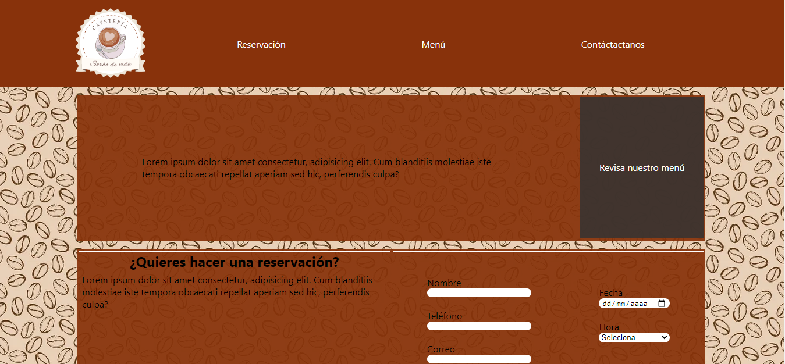

# Restaurant App 

Ver la página -> [cafeteria]()

Este fue un proyecto realizado con React.

Es un proyecto muy básico el cual hace uso de `<Router>` para navegar entre páginas y el `<outlet/>` está localizado todo el tiempo en la parte central de la página (lo que sería el `<jumbotron>`).

El formulario que se maneja en este proyecto consta de: 

-Nombre (de quien hace la reservación)

-Teléfono (de quien hace la reservación)

-Correo (de quien hace la reservación)

-Personas (la cantidad de personas que asistirían)

-Fecha (la fecha de la reservación)

-Hora (de la reservación)

La información del formulario es envía a firestore y almacenada.

El menú de esta cafetería ficticia está guardado en firestore y es traído a la app desde ahí pensando en que si el menú es modificado pueda cambiar auntomáticamente sin tener que estar actualizando manualmente.

La sección de contacto es sóloun complemento vacío, sólo contiene un texto de prueba.

Este proyecto es compatible con dispositivos móviles.
